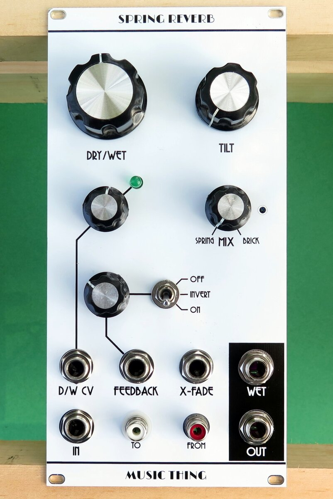
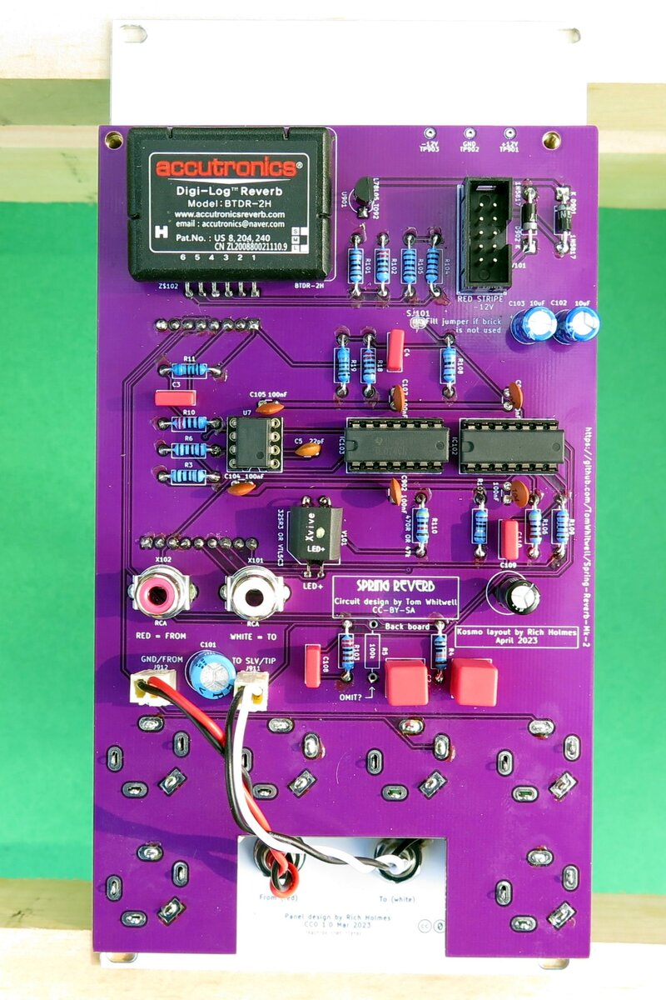

# Spring Reverb

This is a Kosmo format adaptation of the [Music Thing Modular Spring Reverb](https://www.musicthing.co.uk/Spring-Reverb/). (Which is open source, [Creative Commons Attribution-ShareAlike 3.0](https://creativecommons.org/licenses/by-sa/3.0/), so this project is too.)

# Circuit changes

Only very minor tweaks to the original circuit:

* Expansion module (consisting of a potentiometer and a pair of RCA jacks) incorporated into main module
* Single rail-to-rail bypass caps replaced with dual rail-to-ground
* Power reversal protection diodes added
* AC coupling capacitors C1, C2 changed from 10 µF electrolytic to 1 µF film
* Footprint for 100k resistor to ground on IN_2 (FEEDBACK) left in place but marked "OMIT?"

# Discussion

R5, the 100k to ground on input IN_2, is parallel to several other ~50k resistances to ground. This means the input impedance at IN_2 is much lower than the usual 100k. R5 only makes it even lower, and I see no reason why one would want to do that. I left the footprint for this resistor in place but marked it "OMIT?" on the silkscreen and left it out in my build. This resistor is not included in the BOM.

# Errata

* In the v1.0 circuit boards the solder jumper is bridged, not open, so it should be cut if using the brick and left alone if not (contrary to what the silkscreen implies). 

* In the v1.0 front panel the pads around the hole for the "To" phono jack make the jack contact ground. This is incorrect. Use nylon washers on both sides of the hole to isolate the jack, and make sure the hole isn't plated through. 

These errors are corrected in the post-v1.0 versions.

## Current draw

 mA +12 V,  mA -12 V
 
## Photos

## Documentation

* [Schematic](Docs/springReverbRev2_schematic.pdf)
* PCB layout: [front board front side](Docs/Layout/springReverbRev2_FrontPCB/springReverbRev2_FrontPCB_front.svg), [front board back side](Docs/Layout/springReverbRev2_FrontPCB/springReverbRev2_FrontPCB_back.svg), [back board front side](Docs/Layout/springReverbRev2_BackPCB/springReverbRev2_BackPCB_front.svg), [back board back side](Docs/Layout/springReverbRev2_BackPCB/springReverbRev2_BackPCB_back.svg)
* [BOM](Docs/BOM/springReverbRev2_bom.md)
* [Blog post](https://analogoutputblog.wordpress.com/2023/05/06/spring-has-sprung/)

## GitHub repository

* [https://github.com/holmesrichards/mtmreverb](https://github.com/holmesrichards/mtmreverb)
